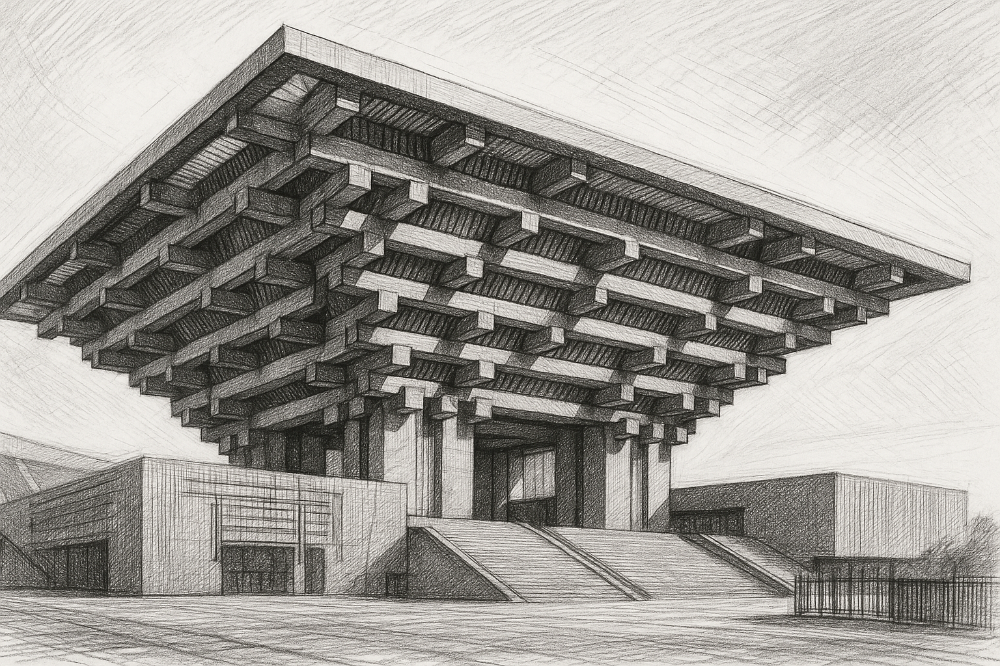
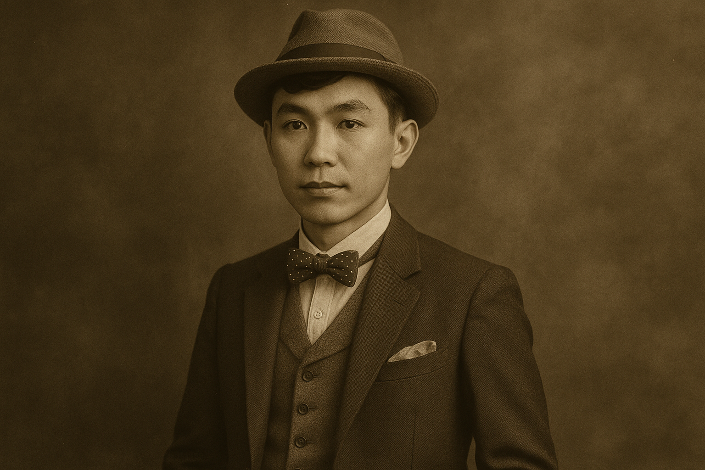

# AI生图终极指南（一）：43种风格全解析，设计师必藏！

最近我一直在折腾各种 AI 生图工具，像 GPT-4o、Sora、豆包轮番上场。作为一名 AI 插画师，搞清楚不同图片风格几乎成了“基本功”——只有吃透了风格特征，才能在不同主题和场景中选对图、出好图。

于是就有了这篇文章。我先请 Claude 帮我系统整理了主流的图片风格资料，共计 43 种风格、划分为 7 大类，逐一梳理了它们的风格特征、关键提示词，以及适用的主题场景，然后再让 GPT-4o 生成对应的生图提示词，并交给 Sora 实际出图（国内用户也可以用豆包、即梦等工具进行创作）。

内容量不小，我打算拆成两篇分享——这篇是第一篇。建议点赞收藏，相信你日后用得着。

## 一、艺术绘画类

### 油画风格

**一句话特征：** 油画风格通过丰富的色彩层次和厚重的笔触呈现立体感，展现出质感强烈的色彩过渡和细节，适合表现具有深度、光影和质感的场景，能营造出沉稳厚重或华丽精致的艺术氛围。
**关键提示词：**`oil painting, renaissance style, impressionist, expressionist`
**适用主题：**  建筑、风景、人物、静物、历史场景、肖像、宗教 


```
oil painting style of Mount Everest summit, breathtaking panoramic view of snow-capped peaks, dramatic lighting, high-altitude atmosphere with clouds surrounding the summit, vibrant colors, soft brushstrokes, serene yet majestic landscape, photorealistic textures
```


```
oil painting style of Shanghai's Bund, detailed skyline with historical and modern architecture, vibrant colors, warm golden sunset light reflecting off the water, lively urban atmosphere, soft brushstrokes, photorealistic textures, high detail
```


```
renaissance style oil painting of a young woman with a serene expression, soft indoor lighting, high detail, soft gradients on the face, subtle smile, detailed fabric and background, natural colors, gentle chiaroscuro lighting, photorealistic textures, realistic facial features, classic Renaissance portrait
```

### 水彩画风格

**一句话特征：**  水彩画风格以透明轻盈的色彩层次感为特点，色彩自然流动融合，呈现出通透明亮的视觉效果，水分的自然扩散形成柔和的边缘，特别适合表达轻松、梦幻或自然的意境。
**关键提示词：**` watercolor painting, wet on wet, watercolor sketch`
**适用主题：** 自然景观、城市景观、花卉植物、人物肖像、静物、山水画、童话场景


```
watercolor painting of the Broken Bridge at West Lake, soft brushstrokes, tranquil atmosphere, delicate lotus flowers blooming on the lake, gentle ripples in the water, pastel tones, serene reflection, misty background, traditional Chinese landscape, vibrant yet soft colors blending into the scenery
```


```
watercolor illustration of a happy child playing in a garden, soft pastel colors, gentle background, whimsical characters, flowers blooming around
```

### 丙烯画风格

**一句话特征：**  丙烯画风格融合了油画的质感和水彩的便捷性，色彩鲜艳饱和，干燥快速且不易褪色，具有多样的表现力，从厚重的肌理到透明的层叠效果均可实现，适合大胆色彩表达与现代艺术呈现。
**关键提示词：** `acrylic painting, acrylic on canvas`
**适用主题：** 花卉植物、水果蔬果、日常用品、人物肖像、宠物动物、几何图形组合、抽象主题、现代艺术场景


```
acrylic painting of blooming Luoyang peonies, vivid and rich colors, thick brushstrokes, layered petals with strong texture, deep green leaves, golden sunlight illuminating the flowers, vibrant background, bold composition, traditional Chinese elegance with expressive modern art style

```


```
acrylic painting of a colorful fruit and vegetable platter, vibrant and saturated colors, thick brushstrokes, textured surfaces, sliced oranges, grapes, tomatoes, bell peppers, arranged on a rustic wooden plate, dramatic shadows and highlights, bold composition with rich contrasts, expressive modern art style
```

### 素描风格

**一句话特征：** 素描风格以线条和明暗对比为主要表现手法，通过精确的轮廓线和渐变的灰度阴影展现物体的形态和立体感，强调光影关系和空间感，呈现出简洁而深刻的黑白艺术效果。
**关键提示词：** `pencil sketch, charcoal drawing, graphite`
**适用主题：** 人物肖像、建筑、静物、风景、动物、植物、几何形体


```
pencil sketch of a young woman, black and white, detailed lines, realistic facial features, portrait close-up
```


```
pencil sketch of the China Art Museum in Shanghai, black and white, detailed architectural lines, strong geometric structure, clear perspective, fine shading on surfaces, dramatic light and shadow contrast, realistic pencil drawing style, traditional sketch rendering of modern Chinese architecture
```


```
pencil sketch of a still life arrangement featuring a fruit bowl, ceramic vase, and glass cup, black and white, realistic proportions, clean linework with subtle graphite shading, reflective textures on the glass, rough matte surface on the pottery, strong light and shadow contrast, traditional academic sketch style on a neutral background
```

### 水墨风格

**一句话特征：** 水墨风格源于东方绘画传统，以浓淡变化的墨色和水的流动性创造意境，注重留白与虚实对比，通过简练的线条和墨晕的渗透扩散效果，表现出空灵、含蓄、意境深远的艺术效果。
**关键提示词：** `Chinese ink painting, sumi-e, brush painting`
**适用主题：** 人物肖像、建筑、静物、山水、花鸟、竹松梅兰、动物、传统建筑、古典场景

 

```
traditional Chinese ink painting of Qili Shantang Street in Suzhou, misty canal scene with arched stone bridges, whitewashed walls and black tile roofs, willows hanging over the water, wooden boats drifting gently, monochrome ink with expressive brushwork, elegant composition with negative space, poetic and serene atmosphere, classic shan shui style
```

 

```
traditional Chinese ink painting of Guilin landscape, dramatic karst mountains rising from calm river waters, mist drifting between peaks, reflections in the Li River, fishermen on bamboo rafts with cormorants, sparse trees and layered mountain ridges, expressive brushstrokes, use of negative space and poetic composition, inspired by ancient Chinese shan shui painting, monochrome ink wash style, evokes a serene and timeless atmosphere
```

### 手绘插画风格

**一句话特征：** 手绘插画风格融合了艺术性与叙事性，以亲和可爱的线条和鲜明色彩为特点，细节简化但富有表现力，常带有童趣与想象力，适合讲述故事、表达情感或创造温馨氛围。
**关键提示词：** `children's book illustration, hand-drawn style`
**适用主题：** 人物、动物、童话场景、日常生活、自然景观、食物、情感表达

 

```
hand-drawn illustration based on the person in the attached photo, clean line art with soft pastel colors, semi-realistic proportions, expressive facial features, subtle textures resembling colored pencil or ink pen, minimalistic background with artistic accents, warm and approachable visual style, suitable for editorial or character-based illustration
```

### 点彩派风格

**一句话特征：** 点彩派风格通过纯色小点的并置与色彩叠加原理创造视觉混合效果，形成明亮、跳跃的色彩感受，画面呈现出颗粒感和震动的光感，特别适合表现光线变化与色彩丰富的自然场景。
**关键提示词：** `pointillism, stippling art`
**适用主题：** 风景、公园、河边场景、花园、城市景观、午后阳光、光影效果

 

```
pointillist painting style, afternoon scene by Kunming Lake in the Summer Palace, Beijing. Dappled sunlight sparkles on the surface of the calm lake, rendered in small colored dots. A few traditional Chinese boats drift near the shore. In the distance, the arched Seventeen-Arch Bridge stretches across the water, and the silhouette of the Tower of Buddhist Incense (Fo Xiang Ge) rises gently on the wooded hill. 

On the shore, willow trees sway softly, their green branches painted with stippled dots of light and shade. Scattered visitors stroll or sit along the stone path, with parasols or hats casting shadows. The scene is filled with pastel blues, soft greens, ochres, and warm sunlight tones, all layered using vibrant pointillist brushwork. The overall composition evokes a sense of peace, harmony, and nostalgic elegance, capturing a timeless afternoon at the lakeside in a dreamy, impressionistic atmosphere.
```


### 版画风格

**一句话特征：** 版画风格以强烈的黑白对比和线条纹理为特点，具有独特的刻印质感，图形简练而有力，常呈现粗犷、朴素或精细的艺术效果，适合表现具有戏剧性或民间风格的主题。
**关键提示词：** `woodcut, linocut, printmaking`
**适用主题：** 民间故事、城市风景、建筑剪影、人物形象、自然景观、动物、传统文化元素

 

```
woodcut print style, traditional Chinese dragon totem symbol as the central subject. The dragon is coiled in a dynamic pose, with flowing whiskers, horns, scales, and claws carefully carved in bold, high-contrast black and white lines. The background features stylized clouds, flames, and ancient pattern borders reminiscent of traditional temple motifs. The overall composition is symmetrical and powerful, with sharp chisel-like textures, strong contrast, and dense negative space. Presented in classic woodblock print technique, emphasizing line work, symbolic abstraction, and cultural gravitas.
```


## 二、人物肖像类

### 人物写实风格

**一句话特征：** 人物写实风格追求对人物形象的精准再现，通过细致的皮肤质感、准确的光影关系和自然的面部表情，呈现出接近真实的肖像效果，能够捕捉人物的性格特征和情感状态。
**关键提示词：** `realistic portrait, studio lighting, photorealistic`
**适用主题：**  人物肖像、职业形象、家庭照、艺术肖像、情感表达、人物特写

 

```
realistic portrait of an Asian woman with an elegant and serene expression, natural skin tones, soft and smooth texture, detailed facial features, expressive eyes, gentle lighting that highlights her face, subtle shading on the skin and hair, photorealistic style with lifelike proportions, delicate details on the hair, calm and sophisticated aura
```

### 漫画风格

**一句话特征：** 漫画风格以简化但富有表现力的线条和夸张的特征为标志，强调人物的情感和个性，细节适度简化，常有特定的艺术约定如大眼睛、特殊发型，具有鲜明的视觉识别性和叙事性。 
**关键提示词：** `anime style, manga, comic art`
**适用主题：**  人物角色、故事场景、动作场面、情感表达、青少年主题、幻想世界

 

```
manga style portrait based on the person in the attached photo, exaggerated proportions with a larger head, big expressive eyes, cute and playful expression, vibrant colors, clean linework, smooth shading, soft gradient background, stylized hair with sharp details, character-focused composition, energetic and youthful vibe
```

### 卡通风格

**一句话特征：** 卡通风格以圆润可爱的形态和简化的细节为特点，色彩明亮饱满，线条流畅圆滑，造型常有夸张和变形，呈现出活泼、俏皮、幽默的视觉效果，特别适合儿童内容和轻松主题。 
**关键提示词：** `Pixar style, Disney style, 3D cartoon`
**适用主题：** 儿童角色、动物形象、童话场景、家庭互动、娱乐主题、教育内容

 
```
cartoon style portrait based on the person in the attached photo, simplified features with exaggerated eyes and smile, bright and bold colors, clean and smooth line art, round face with a cute and cheerful expression, minimal shading, flat background with playful elements, vibrant and energetic character design
```


```
cartoon style, warm family scene, mother and child cooking together in the kitchen, exaggerated expressions, cozy home interior, bright colors
```


 
```
cartoon style, vibrant colors, playful characters, magical forest with talking animals, enchanted treehouse, storybook style
```

### 虚拟偶像风格

**一句话特征：** 虚拟偶像风格融合数字艺术与动漫美学，呈现出精致完美的人物形象，皮肤光滑细腻，发型和服装设计前卫时尚，常有科技感和未来感元素，色彩鲜艳明亮，适合创建虚拟人物形象。
**关键提示词：** `vtuber, virtual idol style`
**适用主题：**  数字人、虚拟主播、游戏角色、科技演示、时尚偶像、社交媒体形象

 

```
virtual idol style portrait based on the person in the attached photo, futuristic and stylized features, large expressive eyes, bright and vibrant hair color, dynamic lighting with glowing accents, smooth skin with digital texture, high-tech outfit with neon elements, sleek and polished design, energetic and charismatic expression, digital art style with a modern anime feel
```

 

```
virtual idol style portrait based on Elon Musk, futuristic and stylized features, sharp and confident expression, sleek and modern hairstyle, high-tech cybernetic outfit with neon accents, expressive eyes with a charismatic glow, digital skin texture with a smooth finish, dynamic lighting with futuristic elements, tech-inspired background with glowing lines and geometric patterns, digital art style with a modern sci-fi anime feel
```

 
```
virtual idol style portrait based on the person in the attached professional attire photo, sleek and futuristic look, high-tech cybernetic suit with neon accents, confident and charismatic expression, stylish and modern hairstyle, expressive eyes with a glowing effect, smooth digital skin texture, dynamic lighting with futuristic elements, tech-inspired background with glowing patterns and geometric shapes, digital art style with a professional yet energetic vibe
```

### 赛博朋克风格

**一句话特征：** 赛博朋克风格以高科技与低生活水平的对比为特点，人物常融合机械义体与生物特征，霓虹灯光与暗色调形成鲜明对比，展现出未来感、反乌托邦气质和科技改造人体的视觉冲击力。
**关键提示词：** `cyberpunk portrait, neon lighting, high tech low life`
**适用主题：**  未来都市、高科技人物、机械改造、黑客文化、反乌托邦场景、科技悬疑

 

```
cyberpunk style portrait based on the person in the attached photo, futuristic cybernetic enhancements with neon glowing accents, sleek high-tech suit with metallic details, sharp and intense expression, holographic elements and digital tattoos, reflective surfaces, glowing eyes with digital effects, dynamic lighting with neon highlights, dark moody urban background with futuristic cityscape, vibrant color contrasts, blending technology and human features
```

 

```
cyberpunk style portrait based on the person in the attached professional attire photo, futuristic high-tech cybernetic suit with glowing neon accents, sleek and sharp design, dynamic lighting with neon lights, intense and confident expression, reflective surfaces and metallic details, glowing tattoos or tech implants, glowing eyes with a digital effect, dark moody background with futuristic cityscape elements, vibrant contrasting colors with a sci-fi atmosphere
```

### 科幻人像风格

**一句话特征：** 科幻人像风格呈现未来进化或改造后的人类形象，结合高科技元素与人体特征，通常有光滑金属质感、几何线条设计和未来感装甲，色调冷峻或带有荧光效果，表现出前沿科技与人类形态的融合。 
**关键提示词：** `sci-fi portrait, futuristic human, android style`
**适用主题：**  未来人类、仿生人、太空探索者、高科技战士、机械改造者、未来领袖形象

 

```
sci-fi style portrait based on the person in the attached photo, futuristic cybernetic enhancements, glowing accents and high-tech armor details, sleek and metallic texture on the skin, intense glowing eyes with digital effects, sharp features and sleek hairstyle, dynamic lighting with neon highlights, digital implants and holographic elements, high-tech fashion outfit with holographic elements, sci-fi background with futuristic cityscape and glowing tech, cutting-edge digital art style with a powerful and energetic vibe
```

### 复古风格

**一句话特征：** 复古风格通过模拟历史时期的摄影或绘画技术，呈现怀旧氛围，常有褪色、颗粒感、柔和对比度等处理，色调偏向棕黄或冷蓝调，展现出历史感和时间痕迹，能唤起对特定年代的情感记忆。
**关键提示词：** `vintage portrait, retro style, film grain`
**适用主题：**  人物肖像、家庭照、婚礼场景、城市风光、老式物件、特定历史年代场景

 

```
vintage style portrait based on the person in the attached photo, soft sepia or muted color tones, classic 1920s or 1930s aesthetic, vintage fashion with elegant details, smooth lighting with soft shadows, retro hairstyle and accessories, delicate facial features with timeless expression, grainy texture for a nostalgic feel, artistic composition with a subtle background, inspired by classic film portraits or old-fashioned photography
```

## 三、真实摄影类

### 纪实风格

**一句话特征：** 纪实风格摄影以客观真实记录为核心，使用自然光线和真实环境，不刻意摆拍，捕捉真实情境和自然表情，画面常带有新闻性和故事性，通过细节表达社会人文关怀或记录历史瞬间。
**关键提示词：** `documentary photo, natural light, photojournalism`
**适用主题：**  社会风景、人物活动、历史事件、自然景观、城市生活、传统文化、民俗活动


```
documentary photography style of the Great Wall at Badaling in April, vibrant springtime atmosphere, natural daylight casting soft shadows on the ancient stone walls, rugged and weathered textures, panoramic view of the long wall winding over the lush green mountains, visitors walking along the path, blossoming trees and flowers in the background, clear blue sky and bright sunshine, historical atmosphere with untouched details, realistic portrayal of the landscape, wide-angle shot capturing the scale and depth with a lively, energetic vibe
```

 

```
documentary-style realistic photography of the iconic "Heavenly Pillar" (Qiankun Pillar) in Zhangjiajie National Forest Park, China, captured on a bright and vibrant spring day in April. The towering sandstone column, known for its dramatic vertical rise, is positioned slightly off-center on the right golden ratio line of the composition, framed by distant karst spires and steep forested cliffs.

The landscape is full of spring vitality, with fresh green foliage, blooming shrubs, and dense subtropical vegetation. Sunlight pours through scattered white clouds in a blue sky, casting soft, warm highlights and gentle shadows on the pillar and the surrounding forest. The perspective is from a natural observation point with no visible tourists or artificial elements. The atmosphere is crisp and refreshing, evoking the feeling of standing in an untouched wilderness during the height of spring’s awakening. The overall image emphasizes spatial depth, geological majesty, and a peaceful harmony between earth and sky.
```

### 微距摄影

**一句话特征：** 微距摄影风格展现细微物体的放大细节，焦点极其精准，景深通常很浅，背景柔和虚化，突出主体纹理、形态和色彩，常用于展示肉眼难以察觉的精细结构和微观世界的奇妙之处。
**关键提示词：** `macro photography, close-up shot, detailed texture`
**适用主题：**   花卉细节、昆虫特写、水滴、质地纹理、微小物体、产品细节、食物质感


```
realistic macro photography style, a honeybee landing gently on the center of a blooming sunflower, with fine morning dew droplets visible on the golden petals and central disk. The bee’s fuzzy body, translucent wings, and tiny legs are captured
```

### 电影风格

**一句话特征：** 电影风格摄影追求电影般的视觉美学，具有宽银幕比例、戏剧性的光影对比、精心设计的构图和色彩处理，常有景深控制和特殊氛围营造，给人以叙事感和情感共鸣，仿佛电影静帧。
**关键提示词：** `cinematic lighting, film still, movie scene`
**适用主题：**  城市景观、室内外人物场景、戏剧性瞬间、情感故事、建筑空间、自然风光、人物互动


```
cinematic photography style of Leifeng Pagoda at West Lake during sunset, golden hour light casting a warm glow on the ancient pagoda, dramatic long shadows and soft lighting on the surrounding landscape, reflections of the pagoda on the calm water of West Lake, vibrant orange and pink sky with scattered clouds, atmospheric lighting with a sense of nostalgia and tranquility, vintage color grading with warm tones and rich contrast, cinematic mood evoking a peaceful yet majestic feeling, wide-angle shot capturing the beauty of the pagoda, lake, and sunset sky
```

### 航拍视角风格

**一句话特征：** 航拍视角风格从高空俯视角度展现场景，呈现出平时难以看到的宏观格局和图案，能够展示地形地貌、建筑群落或自然景观的全貌和空间关系，常有壮观的视觉冲击和透视感。
**关键提示词：** `aerial photography, drone shot, bird's eye view`
**适用主题：**  自然地貌、城市全景、农田格局、海岸线、交通网络、建筑群、大型活动场景


```
aerial photography style of Mount Everest, dramatic high-altitude view of the towering peak covered in snow and ice, surrounding rugged mountain range, deep crevices and glaciers visible from above, vast expanse of the Himalayan range in the background, clear blue sky with wispy clouds, stark contrast between the icy white summit and the rocky slopes, sharp light and shadow details on the mountain face, high-definition capture of the majestic and awe-inspiring landscape, powerful and vast, showcasing the enormity and isolation of the world's highest peak
```

### 街头摄影风格

**一句话特征：**  街头摄影风格捕捉城市公共空间中的自然、非摆拍瞬间，注重人文情怀与日常生活细节，常有抓拍感和随意构图，能够真实记录社会百态、人物表情和城市氛围，展现生活原貌。 
**关键提示词：** `street photography, urban candid`
**适用主题：**   城市日常、街道场景、人物互动、市场小店、公共交通、城市文化、社会生活


```
street photography style in a traditional Chinese old town, stone-paved alley lined with classic noodle shops serving rice noodles, red lanterns hanging overhead, weathered wooden and brick buildings with faded signage, a few small taverns and local vendors as subtle background elements, people sitting or chatting outside, bowls of steaming noodles on small outdoor tables, warm natural daylight casting soft shadows, candid human interactions and relaxed everyday atmosphere, rich in texture and storytelling, documentary-style composition capturing authentic street life in an ancient town
```

### 室内摄影风格

**一句话特征：** 室内摄影风格专注于展现空间的氛围、功能和设计特点，精心控制光线以营造特定情绪，常用广角镜头捕捉空间感，注重细节与构图平衡，展示室内环境的美感、功能与生活状态。
**关键提示词：** `interior scene, soft lighting, architectural photography`
**适用主题：**  家居空间、办公环境、商业场所、建筑内部、酒店客房、艺术展览、工作空间


```
Realistic interior photography style, simple and modern home office space, beige leather texture desktop. In the center of the desktop is an open MacBook Air, placed on a gray desk mat, with a table-like simplified Chinese web page displayed on the screen. Behind the laptop are two 27-inch 4K Philips flat-panel monitors with ultra-thin bezels and minimalist white metal stands - the left monitor is placed vertically and closed, and the right horizontal monitor displays a web page with four travel thumbnails: Leifeng Pagoda at sunset, Zhangjiajie Sandstone Pillars, the main peak of Mount Everest, and the Great Wall of China.

Between the two monitors is a white desk lamp with adjustable height. On the left side of the table are an iPhone 14 mobile phone, a gray fabric zipper storage bag, a black mobile phone stand, and a blue jointed robot building block model. On the right side of the desk are a framed child's photo, a retro flip clock with "15:32" written on it, a yellow and white tissue box with part of the tissue pulled out, and a decorative bunch of dry wheat straw and red flowers in the corner behind.

Soft sunlight pours in from the curtained window on the left, casting realistic diffuse shadows on the table. All cables are neatly arranged. This photo uses a highly realistic documentary style interior photography composition, with careful consideration of light, materials, screen content, and spatial arrangement of objects.
```

## 下一篇预告

这篇文章梳理了 3个大类下的21个风格，并为每种风格提供了`一句话特征说明 + 关键提示词 + 适用主题 + 参考图 + 英文提示词`，可以说是实战派 AI 插画师的风格速查宝典。

在下一篇中，我会继续分享其余4大类下的22个风格：幻想类、场景与建筑风格、设计类风格、其他创意风格。

不论你是想精准选图，还是提升自己的提示词撰写水平，都可以从中获得极大帮助。建议收藏备用，灵感卡壳或选风格困难时，回来看一眼就能“破局”。

如果本文对你有所帮助，请顺手点个赞、转发给身边的设计师朋友！


