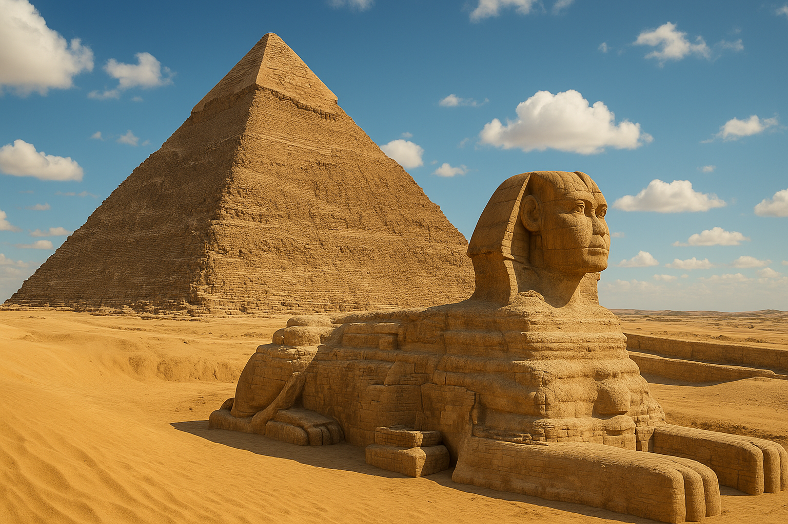
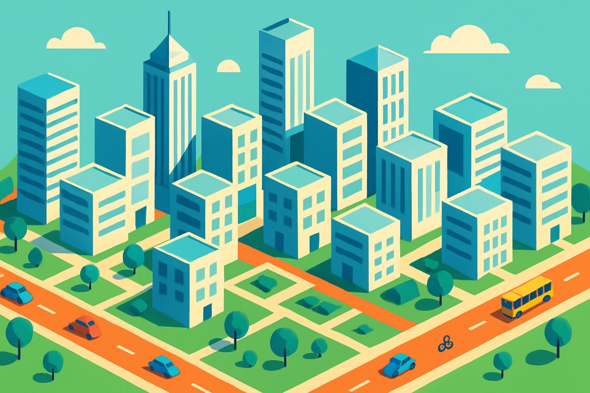

# AI生图终极指南（二）：43种风格全解析，设计师必藏！

最近我一直在折腾各种 AI 生图工具，像 GPT-4o、Sora、豆包等工具轮番试用。作为一名 AI 插画师，搞清楚不同图片风格几乎成了“基本功”——只有吃透了风格特征，才能在不同主题和场景中选对图、出好图。

我先请 Claude 帮我系统整理了主流的图片风格资料，共计 43 种风格、划分为 7 大类，逐一梳理了它们的风格特征、关键提示词，以及适用的主题场景，然后再让 GPT-4o 生成对应的生图提示词，并交给 Sora 实际出图（国内用户也可以用豆包、即梦等工具进行创作）。

接[上一篇](https://mp.weixin.qq.com/s/-ei7Vvavf6BDDw8ozfjluA)，你现在看到的是这个系列的第二篇。建议点赞收藏，相信你日后用得着。

## 四、幻想类

### 魔幻风格

**一句话特征：** 魔幻风格以奇幻元素和神秘氛围为核心，融合中世纪与异域风情，通过鲜艳饱和的色彩和华丽细致的细节，呈现超现实的魔法世界、神秘生物和传奇英雄，营造出充满神秘感和史诗感的幻想场景。
**关键提示词：** `fantasy illustration, wizard, elf, magical world`
**适用主题：** 奇幻世界观、魔法场景、神话传说、史诗冒险、异世界生物、中世纪幻想、传奇英雄、魔法森林、古老巫师


```
fantasy magical style, a heroic scene set in the world of "World of Warcraft." The composition features a powerful night elf druid, standing on a rugged mountain ledge, surrounded by swirling magical energies. The druid’s glowing staff pulses with arcane power as ethereal leaves and branches spiral around them. Their armor is intricately designed with nature-inspired motifs, glowing faintly in vibrant green and silver hues.

In the background, the towering, ancient trees of Ashenvale Forest loom, with mythical creatures like giant owlbears and treants roaming beneath the canopy. The sky above is filled with glowing constellations and floating islands, giving a sense of an ethereal, magical world. Powerful storm clouds gather, as bolts of lightning crackle through the air, hinting at an imminent battle. The scene radiates an atmosphere of mysticism, ancient power, and the beauty of the natural world. The overall composition is dynamic, with magical light streaks and bursts of energy filling the frame.
```


```
fantasy magical style, an epic scene set in a mystical forest. In the foreground, a skilled elven archer stands poised, aiming an intricately designed bow toward an approaching dark force. The archer’s armor shines faintly under the moonlight, and their sharp features are illuminated by the soft glow of a nearby campfire. The air is thick with anticipation as the archer focuses intently on their target, surrounded by ancient trees with twisted branches.

In the background, the silhouette of a towering dark fortress rises above a fiery horizon, with swirling black clouds ominously filling the sky. The ground is littered with the remnants of an old battlefield, where weapons and armor lie abandoned. The scene is imbued with mystical energy, with faint glowing runes scattered across the landscape. Shadows of dark creatures like orcs and goblins are visible in the distance, creeping through the mist.

The atmosphere is filled with a sense of impending battle and ancient magic, with glowing embers from the campfire casting dynamic light and deep shadows across the scene. The composition reflects the grandeur and gravity of a legendary struggle, with a focus on the heroic figure, the magical landscape, and the encroaching darkness.
```

### 科幻风格

**一句话特征：** 科幻风格以未来科技和太空探索为主题，通过冷色调、金属质感和几何线条，展现高度发达的未来文明、外星环境和前沿科技设备，营造出兼具未来感和科技美感的超前世界观。
**关键提示词：** `sci-fi, futuristic, mecha, space scene`
**适用主题：** 未来世界、太空探索、外星文明、高科技设备、机械装置、未来城市、科技革命、人工智能、太空战舰


```
sci-fi fantasy style, an intricate and futuristic quantum computer at the heart of a high-tech lab. The computer is composed of shimmering quantum processors and glowing cables, with each processor suspended in a clear, floating chamber, emitting brilliant blue and green light. The chamber is surrounded by a web of light beams, reflecting off sleek metallic surfaces, creating a dynamic interplay of light and shadow.

In the background, holographic screens display streams of data, algorithms, and quantum waveforms, pulsating with energy. The room is illuminated by neon lights and soft, ambient glows, giving a sense of both cutting-edge technology and scientific mystery. The floor is composed of smooth, reflective surfaces, and the atmosphere is filled with a sense of both elegance and complexity, embodying the essence of next-generation computing.

The quantum computer appears alive, with energy flowing between the processors and light grids, representing the endless possibilities of computation and the unknown realms of quantum mechanics.
```


```
sci-fi fantasy style, a thrilling scene of an alien planet exploration. A team of futuristic explorers, equipped with high-tech exo-suits, is venturing through an alien landscape under a vibrant, purple sky. The explorers' helmets reflect the glowing bioluminescent plants surrounding them, casting an eerie yet mesmerizing light on the terrain.

The landscape is dominated by towering, otherworldly rock formations, with floating islands and waterfalls of glowing liquid cascading down from the sky. Strange alien creatures, with shimmering scales and multiple limbs, can be seen in the distance, observing the explorers. The atmosphere is thick with mystery, and the air appears to shimmer with an unseen energy.

In the distance, an enormous alien city is visible on the horizon, with spires that defy traditional architecture, emitting pulses of light and energy. The entire scene is bathed in a surreal, neon glow, with dynamic shadows cast by the explorers and alien features, emphasizing the sense of adventure and the unknown.
```

### 史诗场景风格

**一句话特征：** 史诗场景风格以宏大壮观的构图和戏剧性的光影为特点，呈现大规模战争、神话场景或伟大冒险，通过强烈的情感张力和细节丰富的场景设计，营造出气势恢宏、震撼人心的视觉冲击。
**关键提示词：** `epic fantasy, battle scene, dragon, mythological`
**适用主题：** 大型战场、史诗冒险、远古神话、龙与英雄、古代文明、壮观景观、宗教场景、神话生物、传奇战争


```
epic fantasy style, an epic final battle between two powerful space empires. The scene is set in deep space, with a vast expanse of stars and nebulae in the background. On the left, a massive space fleet from the galactic empire, with sleek, futuristic starships, launches a coordinated assault, their weapons firing beams of intense light and energy. Their flagship, a colossal warship adorned with shimmering, metallic armor and glowing energy cores, leads the charge.

On the right, a rival empire’s fleet, composed of alien-designed ships, retaliates with beams of green and purple energy, their ships adorned with intricate alien symbols. Explosions of vibrant energy illuminate the space battlefield, creating a stunning contrast against the dark void of space. The battle is fierce, with starships colliding and debris flying through the air, accompanied by flashes of light and shockwaves.

In the foreground, a group of elite soldiers on the bridge of one of the warships observe the chaos, their faces illuminated by the glow of holographic screens and war maps. The composition emphasizes the grand scale of the battle, with dynamic lighting effects and vibrant colors highlighting the technological power and devastating force of the conflict. The atmosphere is filled with tension, heroism, and the dramatic finality of a galaxy-altering event.
```

### 奇幻生物风格

**一句话特征：** 奇幻生物风格专注于展现不存在于现实世界的动物和生物，通过想象性的形态、色彩和细节设计，创造出栩栩如生的神话生物、巨龙、独角兽等，使其既有自然生物的生物学合理性又具超现实的魔幻特质。
**关键提示词：** `magical creature, unicorn, mythical beast`
**适用主题：** 神话生物、巨龙、精灵、独角兽、海怪、混合生物、幻想动物、神兽图鉴、奇幻宠物


```
fantasy creatures style, a majestic unicorn in a radiant, enchanted forest. The unicorn stands gracefully in a clearing, its pure white coat shimmering with soft, ethereal light. A spiraling, golden horn extends from its forehead, glowing with magical energy. The creature’s mane flows like silver mist, catching the light as it moves gently through the magical atmosphere.

Surrounding the unicorn is a forest of ancient trees with towering trunks and glowing leaves, casting a soft, magical radiance over the scene. The ground is covered with soft moss and flowers, and beams of sunlight filter through the dense canopy, creating a beautiful play of light and shadow. Ethereal butterflies and fireflies hover around the unicorn, their wings sparkling in the ambient light.

The atmosphere is tranquil yet awe-inspiring, filled with the sense of magic and purity. The unicorn’s eyes are bright with wisdom, as it gazes peacefully into the distance. The entire scene evokes a sense of wonder and mystery, a realm where mythical creatures roam freely, untouched by time.
```


```
fantasy creatures style, a sleek mechanical wolf roaming the neon-lit streets of a futuristic cyberpunk city. The wolf’s body is composed of shiny metal plates and glowing circuits, with bright blue and purple lights running along its spine and limbs. Its eyes are glowing with a piercing red light, scanning the dark alleys and towering skyscrapers around it. The wolf’s movement is smooth and calculated, a perfect blend of nature and machine.

The city around it is alive with glowing neon signs, holographic billboards, and towering skyscrapers that stretch far into the sky. The streets are bustling with futuristic vehicles and people dressed in cyberpunk attire, while drones hover overhead. The atmosphere is filled with a mix of excitement and danger, as the mechanical wolf strides through the rain-soaked streets, its footsteps echoing against the pavement.

In the distance, the neon-lit skyline of the city looms, casting a colorful reflection on the wet streets. The air is thick with mist and electricity, giving the scene a gritty, high-tech, and dystopian feel. The composition captures the contrast between the organic and the mechanical, with the mechanical wolf at the heart of a chaotic yet vibrant future world.
```

### 暗黑奇幻风格

**一句话特征：** 暗黑奇幻风格融合了哥特式审美与黑暗奇幻元素，通过阴暗的色调、扭曲的形态和阴森的氛围，呈现恐怖、衰败的世界观，常带有不安与危险的视觉暗示，营造出紧张而神秘的氛围。
**关键提示词：** `dark fantasy, gothic atmosphere`
**适用主题：** 黑暗世界、恐怖传说、堕落天使、亡灵生物、地狱场景、诅咒城堡、暗夜生物、哥特建筑、黑暗仪式


```
dark fantasy creatures style, a fierce battle between a fallen knight and a demonic army in a ruined battlefield. The fallen knight, clad in dark, weathered armor, stands tall with a massive, jagged sword raised high, his face hidden beneath a corrupted helmet. His armor is adorned with dark runes, glowing faintly in red, symbolizing his pact with the underworld. His cape billows in the wind, stained with the blood of previous battles.

Opposing him is a horde of demonic creatures, their grotesque, twisted forms towering over the knight. Their skin is blackened, with horns, sharp claws, and glowing eyes. One of the demons, the leader, stands at the front, wielding a fiery axe that radiates intense heat, its flames flickering with a life of their own. The demonic creatures charge forward, snarling and baring their fangs, their energy crackling through the air.

The battlefield is set in a ruined, desolate landscape, with shattered stone structures and blackened earth. Dark clouds swirl overhead, casting ominous shadows across the ground. Lightning flashes in the distance, illuminating the chaos of battle. The air is thick with the smell of sulfur and blood, creating a foreboding atmosphere.

The composition focuses on the clash of forces, capturing the intensity and savagery of the fight, with vivid flashes of fire, magic, and blood. The entire scene conveys a sense of dark heroism, betrayal, and the desperate struggle between good and evil.
```

## 五、场景与建筑风格

### 微缩模型风格

**一句话特征：** 微缩模型风格通过人工制作的精致小场景，呈现出比例缩小的现实世界，常带有清晰的边缘、鲜艳的色彩和强烈的景深，使画面如同精心制作的模型玩具，具有独特的微观世界魅力和手工感。
**关键提示词：** `miniature diorama, capsule scene, tilt-shift effect`
**适用主题：** 城市缩影、微型场景、模型玩具、迷你世界、建筑模型、微观生活场景、微缩公园、小人国


```
miniature model style, a creative capsule-shaped miniature scene placed horizontally. One half of the capsule is a vibrant, fresh green with white text "长沙" (Changsha) and "CHANGSHA" in English. The other half is transparent, showcasing miniature versions of the iconic landmarks in Changsha — the Mao Zedong statue at Orange Isle and the Changsha Jinmao Twin Towers, all carefully crafted inside the capsule without extending beyond the borders. 

The background is a miniature version of Orange Isle and the Jinmao Twin Towers, with a dreamlike, 3D-rendered style. The scene is rich in detail, with a glossy, reflective surface that adds realism to the models. The rendering is done using C4D, giving it a smooth, polished, and otherworldly aesthetic.
```

### 建筑插画风格

**一句话特征：** 建筑插画风格注重展现建筑的结构美学和设计特点，通过精确的线条、透视和比例，呈现建筑物的精确细节和空间关系，常带有设计图纸的简洁感或装饰性的艺术处理，适合表现各类建筑的外观和内部空间。
**关键提示词：** `architectural sketch, blueprint style, isometric view`
**适用主题：** 城市建筑、历史建筑、现代建筑、室内空间、城市规划、纪念建筑、建筑细节、城市天际线、建筑透视图


 
```
architectural illustration style, the intricate architectural details of the Forbidden City. The scene focuses on the iconic golden roofs, intricate dragon carvings, and ornate wooden beams of the palace halls. The scene captures the majestic symmetry of the architecture, highlighting the sweeping, upturned eaves, the decorative ceramic tiles, and the magnificent imperial palace gates adorned with red lacquer and golden accents. 

The atmosphere is rich with historical charm, with the rich red and gold color scheme symbolizing imperial power and fortune. The intricate carvings on the beams and columns depict scenes of mythical creatures, phoenixes, and dragons, each painted with stunning detail. The walls of the palace are adorned with traditional Chinese patterns, with delicate borders and gold leaf details shining in the soft light.

The perspective emphasizes the grand scale of the palace, creating a sense of awe and wonder. Light filters through the palace’s wooden lattices, casting intricate shadows onto the marble floor. The composition showcases the harmony of traditional Chinese architecture, blending artistry, culture, and history into every fine detail.
```

### 中式园林风格

**一句话特征：** 中式园林风格以东方美学为基础，通过曲折山水、亭台楼阁、假山石景等典型元素，营造出诗情画意的东方意境，强调自然与人工的和谐统一，呈现出中国传统园林特有的精致、含蓄与深远韵味。
**关键提示词：** `traditional Chinese garden, oriental landscape`
**适用主题：** 中国园林、古典园林、假山水景、亭台楼阁、江南水乡、文人园林、传统园艺、水墨山水、东方庭院


```
Chinese garden style, a serene and elegant summer scene set in the classical Suzhou garden of the Humble Administrator's Garden (Zhuozheng Yuan). The landscape is filled with lush greenery, graceful willow trees swaying in the warm summer breeze, and a tranquil pond adorned with blooming lotus flowers. The vibrant pink and white lotus petals float serenely on the water’s surface, while koi fish glide gracefully beneath the clear, reflective water.

The scene captures the harmonious blend of nature and architecture, with traditional Chinese pavilions, delicate wooden bridges, and arching stone walkways. The pavilions are adorned with intricately carved wooden beams, tiled roofs, and decorative lattice windows, creating a sense of peacefulness and tranquility. A series of winding paths lead visitors through the garden, offering glimpses of distant courtyards and hidden corners.

The composition emphasizes the beauty of nature’s design, with blooming flowers, lush foliage, and flowing water, evoking a sense of timeless tranquility. The architecture blends seamlessly with the natural elements, creating a perfect balance of serenity and elegance. Soft sunlight filters through the leaves, casting gentle shadows on the stone paths and reflecting off the calm water, enhancing the peaceful, sunlit atmosphere of the garden in the summer season.
```

### 欧式城堡风格

**一句话特征：** 欧式城堡风格以中世纪欧洲防御性建筑为蓝本，通过厚重石墙、尖顶、城垛和拱门等元素，展现宏伟坚固的建筑美学，常带有历史感和神秘气息，营造出古老、威严而神秘的中世纪欧洲风貌。
**关键提示词：** `gothic castle, medieval architecture, stone fortress`
**适用主题：** 中世纪城堡、欧洲宫殿、古堡防御系统、骑士时代、中世纪生活、宫廷场景、贵族宅邸、古代要塞、石砌教堂


```
European castle style, the grand and opulent Versailles Palace, showcasing the magnificence of French Baroque architecture. The scene focuses on the palace's majestic exterior, with its intricate, symmetrical facades, towering columns, and golden accents that symbolize royal power and wealth. The palace is surrounded by vast, manicured gardens with geometric pathways, fountains, and ornamental sculptures, reflecting the refined taste of French royalty.

The composition emphasizes the scale and grandeur of the palace, with detailed carvings of mythological figures and royal insignia adorning the walls and arches. The vast gardens are in full bloom, with vibrant flowers and neatly trimmed hedges leading up to the palace entrance. A large central fountain is spraying water into the air, adding a sense of movement and life to the otherwise regal and still scene.

The sky is bright and clear, with **sunshine streaming down**, casting soft golden light on the palace’s golden trim and creating warm shadows. The **blue sky and white clouds** further enhance the majestic, sunlit atmosphere of the garden and the palace, emphasizing the luxury, history, and opulence of the French monarchy during the 17th century.
```


```
European castle style, the historic Edinburgh Castle perched atop a rocky hill, overlooking the city of Edinburgh. The scene captures the castle's imposing stone walls, its towering turrets, and the rugged cliffside that it rests upon, creating a dramatic and formidable atmosphere. The castle's ancient stonework is adorned with moss and ivy, reflecting its long history and resilience.

The castle's main entrance is flanked by large wooden doors and guarded by ancient cannons, emphasizing its military past. The narrow pathways and stone staircases lead up to the castle's inner courtyard, where the iconic St. Margaret's Chapel, one of the oldest surviving buildings in Scotland, is visible in the distance.

The sky is bright and clear, with **sunshine warming the ancient stone walls**, casting deep, textured shadows. **The blue sky and white clouds** add a sense of openness, enhancing the fortress’s powerful and mysterious presence. The composition highlights the contrast between the ancient stone structure and the modern city below, with the sprawling cityscape in the background, providing a sense of continuity and history.
```

### 科幻建筑风格

**一句话特征：** 科幻建筑风格以未来主义设计理念为核心，通过流线型结构、悬浮元素和创新材质，展现超越当今技术水平的建筑想象，常融合霓虹灯光、全息投影和非传统几何形态，营造出前卫、高科技的未来城市景观。
**关键提示词：** `floating city, cyberpunk architecture, futuristic structure`
**适用主题：** 未来都市、太空殖民地、水下建筑、智能城市、悬浮建筑、高科技总部、未来居住空间、能源枢纽、虚拟现实建筑


```
sci-fi architecture style, a futuristic cityscape with towering skyscrapers and sleek, metallic structures. The buildings are designed with flowing, organic curves and sharp, angular edges, featuring transparent glass surfaces, glowing neon lights, and intricate geometric patterns that pulsate with energy. The architecture blends high-tech materials like chrome, titanium, and holographic elements, creating a city that feels both advanced and otherworldly.

The city is illuminated by vibrant neon colors, with towering holographic billboards displaying dynamic advertisements and digital art. The streets below are bustling with hovercrafts and pedestrians wearing high-tech clothing, walking through streets lined with towering green plants and futuristic fountains.

The atmosphere is electric, with the night sky lit by floating lights and artificial stars, creating a vibrant yet slightly dystopian feeling. The city's skyline is dominated by sleek towers and floating platforms, with advanced transportation systems weaving between the structures. The overall design emphasizes a blend of technology and nature, creating a harmonious yet futuristic urban environment.
```

### 世界奇观风格

**一句话特征：** 世界奇观风格以地球上著名的自然或人造景观为主题，通过精细的细节和宏伟的视角，展现这些景点的壮观和独特之处，常带有纪念碑式的庄严感和地标性的视觉识别特征，唤起对世界各地伟大景观的赞叹。
**关键提示词：** `world wonders, landmark illustration`
**适用主题：** 世界遗产、自然奇观、历史遗迹、著名地标、古代建筑群、文化名胜、自然景观、旅游胜地、地理标志



```
World wonders style, the majestic ancient Egyptian pyramids and the iconic Sphinx standing proudly against the backdrop of the golden desert. The scene focuses on the towering Great Pyramid of Giza with its perfectly geometric shape, surrounded by the vast desert sands. Nearby, the Sphinx, with its lion's body and human face, gazes solemnly toward the horizon, adding an air of mystery and ancient power to the scene.

The warm sunshine illuminates the massive stone structures, casting long, dramatic shadows on the ground. The light enhances the intricate carvings on the pyramid’s surface and the weathered features of the Sphinx, highlighting their historical significance and architectural brilliance. The sky is a brilliant blue, with soft white clouds drifting across, creating a serene and awe-inspiring atmosphere.

The desert stretches endlessly, with palm trees and small sand dunes scattered around. The sunlight creates a golden glow over the stone, emphasizing the grandeur of the pyramids and the Sphinx, and the ancient mystery they embody. The overall composition blends history, architecture, and nature, with a sense of timelessness and awe.
```


```
World wonders style, the vibrant coral reefs of the Red Sea, teeming with colorful marine life beneath the crystal-clear water. The scene captures the kaleidoscope of coral in hues of bright pink, orange, and purple, with schools of tropical fish swimming gracefully through the clear water. The sun shines brightly overhead, casting dappled light through the water and onto the sandy ocean floor.

Above the surface, the brilliant blue sky stretches endlessly, dotted with fluffy white clouds. The water’s surface reflects the sunlight, creating a shimmering effect that enhances the beauty of the underwater world below. The coral structures rise from the ocean floor, their intricate forms creating an underwater wonderland, while the marine life thrives in this vibrant ecosystem.

The atmosphere is warm and inviting, with the sun filtering through the water and creating a serene and peaceful environment. The blue sky and white clouds further emphasize the vibrancy of the water and the beauty of the coral reef.
```

## 六、设计类风格

### 扁平插图风格 

**一句话特征：** 扁平插图风格以简化的图形和明亮的色彩为特点，摒弃复杂的渐变和阴影，采用无深度的二维表现手法，通过简洁、清晰的图形化表达，创造出现代感强、视觉传达直接的插画效果。
**关键提示词：** `flat infographic, minimalist design`
**适用主题：** 信息图表、数据可视化、界面设计、教育内容、简约插画、移动应用界面、产品说明、企业形象、简化概念


```
Flat illustration style, a playful and colorful scene of a children's game, featuring a bright and cheerful environment. The image includes smiling children, playing in a vibrant playground filled with simple geometric shapes and fun objects. The children are depicted with exaggerated features, such as large, expressive eyes and round, cartoonish faces, all wearing bright, primary-colored clothing.

In the background, there are brightly colored swings, a slide, and a sandbox, all designed with clean lines and flat colors. The playground is surrounded by simple trees with rounded tops and soft, pastel-colored clouds in a clear blue sky. The ground is dotted with colorful shapes, like triangles, circles, and squares, adding to the playful feel of the scene.

The overall composition is minimalistic, with no complex details or gradients, keeping the focus on the joyful atmosphere and simple shapes. The bright, flat colors and smooth lines create a lively and fun vibe, making the scene perfect for a children's game illustration.
```


```
Flat illustration style, a vibrant and modern scene representing digital technology and artificial intelligence. The central focus is on a stylized robot head, with simple geometric shapes, smooth lines, and a glowing digital display screen for the face. The robot's design is sleek and minimalist, using a palette of cool blues and silvers with contrasting bright neon accents for the eyes and circuits.

Surrounding the robot are abstract, floating symbols representing technology, such as cloud icons, circuit board lines, binary code, and algorithmic patterns. These elements are all designed in flat colors with no gradients or shadows, maintaining a clean and futuristic look. The background features interconnected lines and nodes, symbolizing a network or digital connections, further emphasizing the theme of artificial intelligence.

The overall atmosphere is one of innovation and progress, with simple, bold shapes and vibrant colors that make the scene feel dynamic and forward-thinking. The flat design style allows the focus to remain on the digital elements and their connection to artificial intelligence.
```


```
Flat illustration style, a vibrant and colorful depiction of an ecological farm with an emphasis on organic farming practices and sustainable agriculture. The scene includes rows of healthy crops, such as tomatoes, carrots, and leafy greens, growing in nutrient-rich soil without chemical fertilizers. A farmer, depicted with simple geometric shapes and bright clothing, is tending to the plants under a warm sun, creating a lively, welcoming atmosphere.

In the background, a wind turbine and solar panels are visible, symbolizing the farm's use of renewable energy sources. Nearby, a small pond reflects the blue sky, surrounded by lush greenery and small animals like birds and insects, which add to the ecosystem's biodiversity. The sky is bright with soft white clouds, and the landscape is dotted with trees, creating a sense of harmony between nature and agriculture.

The overall composition is clean and modern, with flat colors, bold outlines, and no gradients or shadows, keeping the focus on the vibrant, healthy landscape and the harmonious coexistence of farming and nature.
```

### 图标风格

**一句话特征：** 图标风格以高度简化和符号化的视觉元素为核心，通过抽象化的线条、形状和色块，将复杂概念简化为直观易懂的符号，强调清晰的形态和即时的可识别性，适合表达各类功能和概念。
**关键提示词：** `icon style, line art, simplified graphics`
**适用主题：** 应用图标、导视系统、功能符号、界面元素、简化插图、品牌标志、操作指引、图形界面、概念图标


```
Icon style, a modern and clean design showcasing the theme of office work and artificial intelligence. The scene features simple, flat icons representing key elements of an office environment, such as a laptop, a smart assistant, a wireless mouse, and a cloud storage symbol. Each icon is created with bold lines, minimal shapes, and bright, contrasting colors.

The laptop icon is sleek and minimalistic, with a flat screen displaying a simple interface, symbolizing modern office work. The smart assistant is represented by a circular icon with a voice wave emanating from it, indicating the presence of AI technology. The cloud storage icon features a cloud with a download arrow, symbolizing data storage and AI integration.

The icons are arranged neatly in a horizontal row, with a few abstract lines and dots representing connectivity and the digital environment of the modern workplace. The background is clean and white, with subtle geometric patterns to enhance the modern, professional feel of the design. No gradients or shadows are used, maintaining the flat design aesthetic that is typical of icon-style art.
```

### UI Mock 风格

**一句话特征：** UI Mock风格以数字界面设计为核心，通过模拟应用程序、网站或软件的屏幕布局，展现用户界面的组织结构、交互元素和视觉层次，常带有网格对齐和精确间距的设计特点，呈现出现代数字产品的界面美学。
**关键提示词：** `UI/UX wireframe, mobile app design, interface mockup`
**适用主题：** 应用界面、网站设计、软件界面、移动应用、用户体验、屏幕原型、交互设计、界面组件、操作面板


```
UI Mock style, a modern and clean design for a mobile banking app interface. The screen shows a simple, user-friendly layout with a top navigation bar featuring icons for "Home", "Transactions", "Settings", and "Profile". Below, there is a dashboard showing the user's current balance, recent transactions, and a quick access button to transfer money.

The background is a smooth gradient of light blue and white, with a large, bold number indicating the balance. The transaction list is neatly organized in a list view with clear headings, showing the amount, date, and merchant icons. Below the list, there are interactive buttons for "Send Money" and "Add Account", designed with flat icons and contrasting colors for easy visibility.

The overall design is minimalist, with ample white space, simple lines, and high contrast colors for clear legibility. Icons are simple, flat, and easily recognizable. The design also includes a subtle drop shadow effect on the cards and buttons for a sleek and modern feel. There are no gradients, just flat colors, ensuring a clear and straightforward interface for user interaction.
```

### 等距视图

**一句话特征：** 等距视图以特定的30度角投影方式呈现三维空间，所有平行线保持等距不会随视距变化，创造出既有3D感又保持几何精确性的表现效果，常用于展示建筑、城市规划或技术结构，具有独特的几何美感。
**关键提示词：** `isometric design, 3D technical illustration`
**适用主题：** 建筑透视、技术图解、游戏场景、城市规划、机械构造、空间布局、产品展示、室内设计、建筑剖面



```
Isometric view style, a clean and modern design of a futuristic cityscape, showing a highly organized and geometric urban environment. The scene features multiple tall skyscrapers and smaller buildings arranged in a grid pattern, all with sharp, geometric lines and flat surfaces. The buildings are displayed in equal proportions with no perspective distortion, highlighting their block-like, cubic shapes.

The city is set in an open area with wide streets, neatly organized parks, and roadways, all rendered in flat, vibrant colors. Streets are lined with simple geometric shapes representing cars, buses, and bicycles, all aligned in the same perspective to maintain the isometric view.

Green spaces with circular trees, square garden plots, and clean sidewalks are visible throughout the city, adding to the organized and efficient layout. The background features a sky filled with a few light clouds, offering a calming, simplistic feel. The scene utilizes bold, flat colors with no gradients or shading, adhering to the principles of isometric design.

Overall, the cityscape is well-balanced, with a focus on clarity, geometric precision, and a futuristic urban design. The isometric projection gives the city a visually appealing, three-dimensional effect while maintaining simplicity and order.
```

### 商业插图风格 

**一句话特征：** 商业插图风格以传达明确信息和吸引目标受众为目的，通过专业、精致的画面处理和现代设计元素，展现产品、服务或概念的核心价值，风格干净利落，细节精确，常带有品牌一致性和市场定位考量。
**关键提示词：** `commercial illustration, marketing visual`
**适用主题：** 品牌形象、广告插画、产品展示、市场营销、企业宣传、包装设计、活动推广、行业形象、服务说明


```
Commercial illustration style, a modern and professional scene representing a bustling office workspace. The image shows a well-organized office environment with sleek desks, ergonomic chairs, and multiple computers. The space is bright and open, with large windows letting in natural light, creating a welcoming and productive atmosphere.

In the foreground, a group of professionals, depicted in a simple, clean style, are having a meeting around a round table, with laptops, notebooks, and coffee cups on the table. They are dressed in smart business attire, with simple, bold colors that make them stand out against the minimalist background. The meeting room is equipped with a large whiteboard, a potted plant in the corner, and abstract art on the walls, adding a touch of personality to the space.

The background features additional office spaces, including desks with stationery, office supplies, and modern tech gadgets like smartphones and tablets. The overall color scheme is a mix of neutral tones with pops of vibrant colors, creating a balanced, professional, and energetic look. The design uses smooth lines, minimal details, and flat colors to maintain a clean and polished look, ideal for commercial illustrations.
```

## 七、其他创意风格

### 赛博像素风格

**一句话特征：** 赛博像素风格融合了像素艺术的复古质感与赛博朋克的未来感，通过小方块构成的图像和有限的色彩，呈现数字化、低分辨率的视觉效果，同时融入霓虹灯光和科技元素，营造出既怀旧又前卫的数字美学。
**关键提示词：** `pixel art, 8-bit style, retro gaming`
**适用主题：** 复古游戏、数字角色、像素场景、电子世界、复古科技、数字艺术、游戏人物、虚拟空间、电子景观


```
Cyber Pixel style, a vibrant and dynamic digital scene featuring a futuristic cityscape in pixel art. The image shows neon-lit streets with glowing signs and billboards, depicting a cyberpunk atmosphere. Tall skyscrapers with pixelated windows are adorned with bright, colorful lights, creating a bustling, high-tech urban environment. The city is alive with movement, with pixelated vehicles speeding along the streets and pedestrians with glowing accessories.

The scene includes detailed elements like a pixelated hover car flying above the streets, digital billboards displaying pixelated advertisements, and a glowing, pixelated skyline with futuristic architecture. The ground is filled with pixelated puddles reflecting neon lights, adding to the immersive, tech-heavy atmosphere.

The overall design uses sharp, square-shaped pixels with bold neon colors like electric blue, pink, purple, and green, enhancing the cyberpunk theme. The color palette is rich and energetic, with dark shadows and bright neon highlights, giving the image a vibrant, yet gritty look. The pixelated elements emphasize the **retro-futuristic** style of the scene, combining the nostalgia of 8-bit graphics with a vision of the future.
```

### 概念艺术风格

**一句话特征：** 概念艺术风格着眼于视觉构想和世界观设计，通过富有想象力的场景、角色和环境描绘，为游戏、电影或娱乐媒体创建视觉基础，强调气氛营造和视觉冲击，通常具有高度的创意性和强烈的美术方向感。
**关键提示词：** `concept art, game concept, entertainment design`
**适用主题：** 游戏场景、电影概念、未实现世界、角色设计、环境设计、装备道具、生物设计、场景构想、视觉开发


```
Concept Art style, an imaginative and vibrant scene depicting an alien ecosystem on a distant planet. The landscape is dominated by otherworldly flora, with towering, bioluminescent plants casting a soft glow over the terrain. Alien trees have twisting, organic trunks and leaves that shimmer with iridescent colors, resembling an exotic blend of crystal and plant matter.

In the foreground, alien creatures roam the terrain — some are floating in the air, while others are crawling along the ground. These creatures are strange yet beautiful, with translucent skin, glowing markings, and segmented bodies. Their eyes are large and reflective, adapted to the bright alien sun.

The sky above is painted in shades of violet and orange, with multiple moons casting eerie shadows across the landscape. The atmosphere is thick with a soft mist, adding to the mysterious and otherworldly feel. In the distance, rocky mountains with unusual formations rise up, and a glowing river flows through the alien jungle, its water shimmering with an ethereal light.

The scene uses a rich and vibrant color palette, blending vibrant neon greens, purples, and blues with the soft, glowing tones of the bioluminescent flora. The overall composition focuses on the alien beauty and the harmonious connection between the environment and the lifeforms that inhabit it, evoking a sense of wonder and exploration.
```

### 霓虹科技风格

**一句话特征：** 霓虹科技风格以明亮的发光元素和高科技感为特点，通过鲜艳的霓虹灯效、光晕和反光表面，展现未来感和数字化世界，色彩饱和度高、对比强烈，营造出充满活力的高科技视觉体验。
**关键提示词：** `neon cyber, glowing edges, digital technology`
**适用主题：** 科技界面、数字艺术、未来世界、夜间城市、电子产品、高科技环境、虚拟空间、游戏界面、数字概念


```
Neon Tech style, a futuristic cityscape illuminated by vibrant neon lights and advanced technology. The scene showcases towering skyscrapers with sleek, reflective surfaces and glowing neon lines running along their edges. The city streets are alive with color, featuring glowing holographic billboards, digital advertisements, and neon signs in various shades of electric blue, pink, purple, and green.

The streets are bustling with activity, as pedestrians and hover cars move through the urban landscape. The people are dressed in futuristic attire, and some are carrying high-tech gadgets that emit soft, ambient glows. The hover cars glide smoothly through the streets, leaving light trails behind them. Above, the sky is filled with digital clouds and a series of hovering drones scanning the area, contributing to the high-tech atmosphere.

In the background, large structures with illuminated patterns and holographic displays dominate the skyline, representing the fusion of technology and architecture. The atmosphere is vibrant and energetic, with neon lights reflecting off glass surfaces and creating dramatic shadows and highlights. The color palette is rich with contrasting neon colors, glowing accents, and sharp lines, conveying a sense of modernity, innovation, and digital sophistication.
```

### 蒸汽波风格

**一句话特征：** 蒸汽波风格融合了1980-90年代复古美学与互联网早期元素，通过粉紫色调、网格背景、老式电脑图形和古典雕塑等元素的碰撞，创造出怀旧而超现实的氛围，表达数字时代的文化挪用和怀旧情绪。
**关键提示词：** `vaporwave aesthetic, retro glitch, synthwave`
**适用主题：** 复古科技、数字怀旧、网络文化、消费主义、80年代风格、数字拼贴、视觉干扰、电子音乐、互联网文化


```
Vaporwave style, a surreal and nostalgic scene that combines retro aesthetics with futuristic elements. The image showcases a dreamy, pastel-colored cityscape filled with geometric shapes, ancient Greek statues, and neon lights. The city is bathed in soft pink, purple, and turquoise hues, with floating grids and digital glitch effects that add a sense of abstract futurism.

In the foreground, a giant neon palm tree stands tall, glowing against a backdrop of retro-futuristic buildings. The architecture has a mix of 80s and 90s influences, with pixelated surfaces, VHS tape-like textures, and neon signs in bold, colorful fonts. On the streets, a classic sports car is parked next to a large digital screen showing looping 3D graphics of glitch art.

The sky above is filled with surreal elements such as digital clouds, glowing geometric shapes, and a large, pixelated sun that casts a soft, faded glow over the entire scene. The atmosphere is enhanced with a sense of nostalgia, evoking the feeling of a bygone era merged with futuristic digital aesthetics. The overall color palette is a mix of vibrant neon tones, soft gradients, and vintage-inspired textures, giving the image a dreamy, retro-futuristic vibe.
```

### 拼贴艺术风格

**一句话特征：** 拼贴艺术风格通过将不同来源的图像、材质和元素组合在一起，创造出新的视觉叙事和意义，常利用照片、插图、纹理等多种媒介的碰撞与层叠，形成混合的视觉语言，表达复杂或超现实的思想。
**关键提示词：** `collage art, mixed media`
**适用主题：** 混合媒介、视觉叙事、文化评论、超现实场景、概念表达、情绪表现、文字与图像、报纸杂志元素、多层次创作


```
Collage art style, a surreal and creative composition combining vintage black-and-white photographs, bold magazine cut-outs, and colorful abstract shapes. The central figure is a retro-style woman from a 1950s fashion ad, her face partially replaced with a blooming sunflower and geometric patterns. Around her, fragments of classic architecture, old newspaper headlines, and vintage postage stamps float freely, arranged in a seemingly chaotic yet balanced layout.

The background features layered paper textures, torn edges, and overlapping brush strokes, creating a handcrafted and experimental look. Bright pops of primary colors — red, yellow, and blue — intersect with monochrome elements, creating strong visual contrast. Cut-out stars, clouds, and butterflies are scattered throughout, adding a whimsical tone.

Some text elements in mismatched fonts are collaged into the image, like hand-cut ransom letters or vintage advertisements. The entire composition has a slightly weathered, analog texture, mimicking the feel of handmade physical collages. The layout is asymmetric but carefully composed, celebrating creativity, imperfection, and narrative layering.

This collage-style composition fuses retro aesthetics, surreal symbolism, and modern visual chaos — resulting in a vivid and thought-provoking artistic statement.
```

### 抽象艺术风格

**一句话特征：** 抽象艺术风格摒弃了对现实物体的具象描绘，通过纯粹的形状、色彩、线条和纹理，表达情感和概念，不依赖于可识别的对象，而是通过视觉元素本身的组织和关系，创造出非具象的视觉体验。
**关键提示词：** `abstract art, non-representational`
**适用主题：** 情感表达、色彩研究、形式探索、视觉节奏、精神状态、概念抽象、构成艺术、几何抽象、表现主义


```
Abstract art style, a vibrant and emotionally expressive composition filled with bold brush strokes, geometric shapes, and dynamic color contrasts. The image features a non-representational layout where color, form, and texture take center stage. Swirling patterns in vivid reds, blues, and yellows dance across the canvas, intersecting with sharp black lines and layered transparent shapes.

The composition includes overlapping circles, triangles, and curved fragments arranged in a chaotic but visually harmonious flow. The texture is rich and painterly, with visible brush marks, palette knife scrapes, and layered splashes of acrylic or oil paint. Negative space is used creatively to balance density and openness, allowing the eye to travel freely across the image.

The overall feeling is energetic and emotional, evoking a sense of movement, rhythm, and spontaneous expression. The palette is bold and saturated, featuring high-contrast combinations that create tension and excitement. No literal subject is depicted — the focus is on abstract visual language and intuitive design.

The scene mimics a museum-quality canvas artwork in large scale, ideal for use in fine art settings, expressive design backdrops, or creative experimentation.
```

## 总结

这篇文章继续深入探索了 AI 生图的风格领域，从幻想类到创意类，共整理了4个大类下的22种风格，为每一种风格提供了`一句话特征说明 + 关键提示词 + 适用主题 + 参考图 + 英文提示词`，可以说是实战派 AI 插画师的风格速查宝典。

无论你是在构思 prompt、选择风格、还是寻找灵感参考，这份资料都能帮你迅速破局，提升效率。
建议收藏备用，灵感枯竭时翻出来看看，总有惊喜。

如果本文对你有所帮助，请顺手点个赞、转发给身边的设计师朋友！


